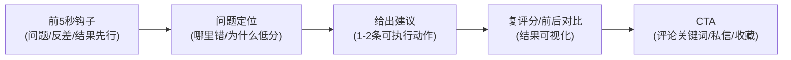
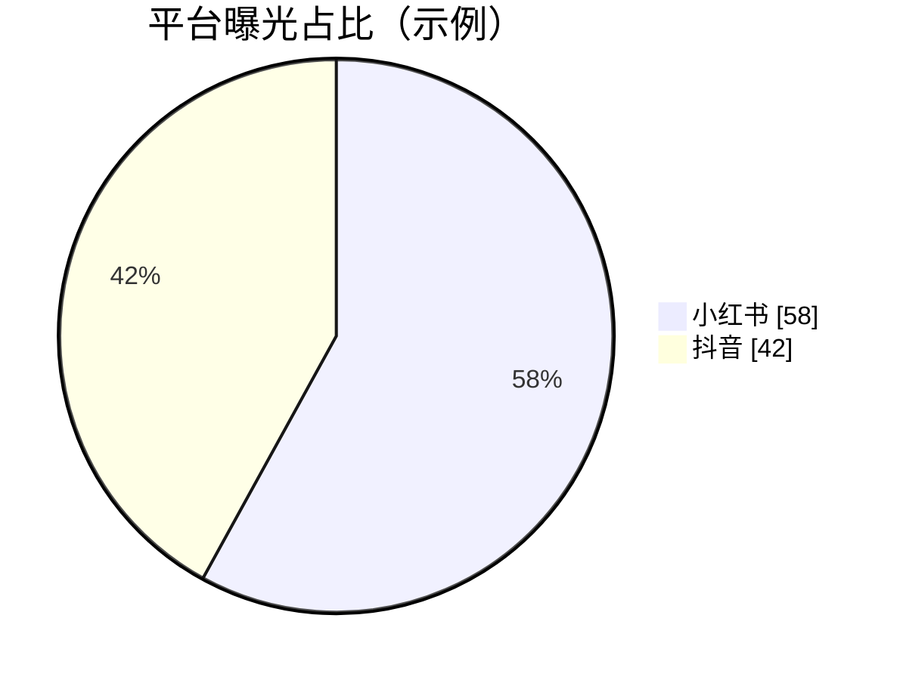
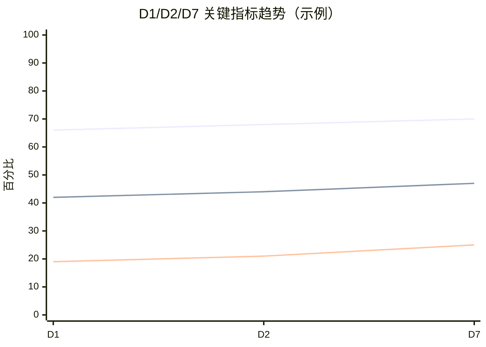
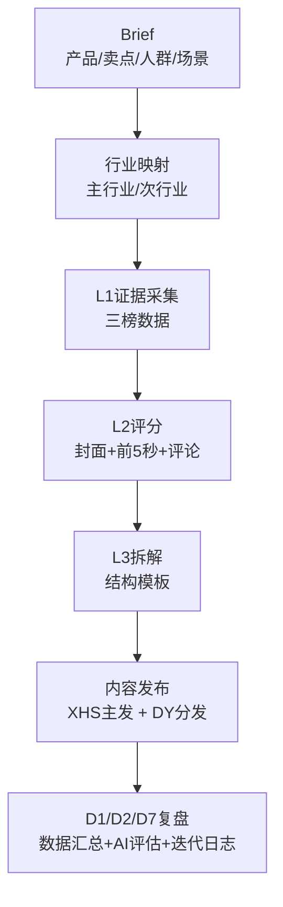

# SOCIAL MEDIA 可视化复盘报告模板（含示例）

> 目标：有图有真相、有逻辑可信赖、易理解易认可  
> 适用：小红书主站 + 抖音分发，按 Day1 / Day2 / Day7 复盘

---

## 0. 报告基本信息
- 报告周期：`YYYY-MM-DD ~ YYYY-MM-DD`
- SKU/项目：``
- 主平台：`小红书`
- 分发平台：`抖音`
- 报告负责人：``
- 数据来源：`平台后台 + 新红榜单 + 手工标注`

---

## 1. 一页结论（先给管理层看）

### 1.1 结论摘要（3句话）
1. 本周期核心结果：``
2. 最大增益点：``
3. 最大风险点：``

### 1.2 KPI看板（目标 vs 实际）
| 指标 | 目标值 | 实际值 | 差值 | 判定 |
|---|---:|---:|---:|---|
| 封面点击率 | 8.0% | 7.2% | -0.8pp | 未达标 |
| 2秒跳出率 | <=35% | 33% | +2pp(优) | 达标 |
| 5秒留存率 | >=40% | 42% | +2pp | 达标 |
| 点赞率 | >=2.5% | 2.8% | +0.3pp | 达标 |
| 收藏率 | >=1.8% | 1.4% | -0.4pp | 未达标 |

### 1.3 管理动作建议（只写3条）
1. ``
2. ``
3. ``

---

## 2. 样本可视化（有图有真相）

### 2.1 本周期样本图墙（建议9宫格）
> 规则：每条内容至少放 1 张封面 + 1 张关键帧（前5秒）  
> 示例占位（替换为真实路径）：

### 2.2 爆款结构拆解图（模板化表达）

---

## 3. 数据可视化（核心）

### 3.1 平台贡献占比

### 3.2 漏斗图（从曝光到互动）
| 漏斗环节 | 数值 | 转化率 |
|---|---:|---:|
| 曝光 | 120000 | - |
| 点击 | 9000 | 7.5% |
| 3秒观看 | 5400 | 60.0% |
| 互动(赞藏评转) | 2200 | 40.7% |
| 私信/线索 | 130 | 5.9% |

### 3.3 Day1/Day2/Day7 趋势图（关键指标）

### 3.4 内容级别热力表（模板评估）
| 内容ID | 2秒跳出 | 5秒留存 | 收藏率 | 评论率 | 模板结论 |
|---|---:|---:|---:|---:|---|
| C-001 | 33% | 42% | 1.4% | 0.35% | Hold |
| C-002 | 29% | 46% | 2.1% | 0.42% | Promote候选 |
| C-003 | 41% | 31% | 0.9% | 0.18% | Discard候选 |

---

## 4. 逻辑链路（为什么可信）

### 4.1 证据链（输入 -> 过程 -> 输出）

### 4.2 问题归因矩阵（示例）
| 问题 | 证据 | 可能原因 | 修正动作 | 验证节点 |
|---|---|---|---|---|
| 跳出偏高 | D1 2秒跳出>35% | 前3秒未结果先行 | 第2秒前展示评分结果 | D2 |
| 收藏偏低 | 收藏率<1.8% | 建议不够清单化 | 增加“2步卡片”字幕 | D2 |
| 转化偏低 | 私信率低 | CTA过弱 | CTA改“关键词领取模板” | D7 |

---

## 5. 迭代计划（下阶段怎么做）

### 5.1 只改 1-2 个变量（避免混杂）
| 模板ID | 本轮改动 | 预期影响指标 | 风险 | 负责人 |
|---|---|---|---|---|
| T-A | 前5秒改“分数先出” | 降低2秒跳出 | 口播节奏过快 | 内容运营 |
| T-B | 增加清单字幕卡 | 提升收藏率 | 信息密度过高 | 剪辑 |

### 5.2 晋级标准（Promote / Hold / Discard）
- Promote：连续2条达标，且 D7 无明显衰减
- Hold：部分达标但不稳定
- Discard：连续2轮修正无改善

---

## 6. 附录（强烈建议）
1. 新红榜单证据截图/链接
2. 关键内容详情页截图
3. 复盘三表原始数据（CSV或表格链接）
4. 版本变更记录（模板从 v1.x 到 v2.x）

